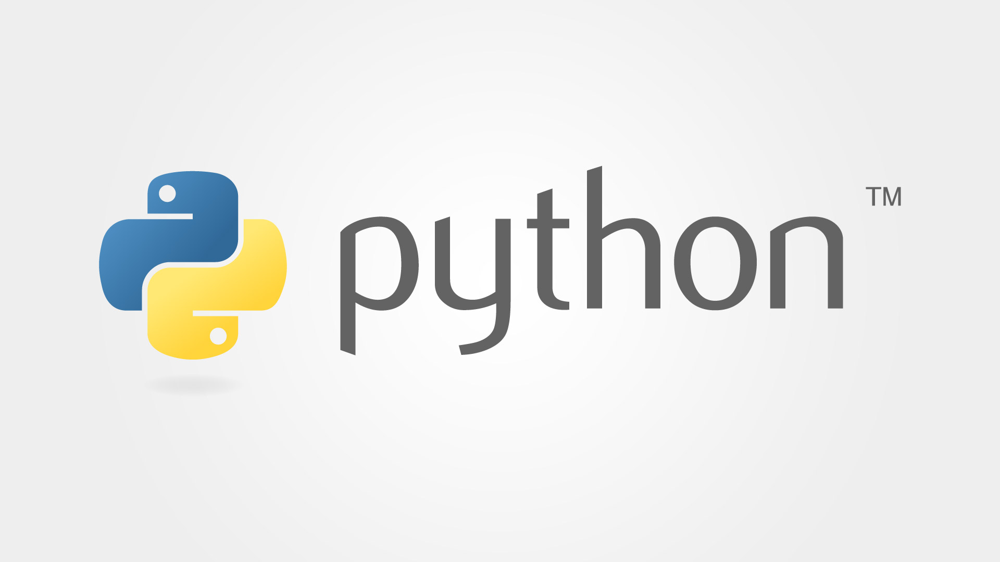

# Savio-Feng-Python-Notes
**You can find in this repository, all my notes about Python.**
## Introduction of Python
Python is a popular programming language that can be used for various purposes, such as web development, data analysis, machine learning, automation, and more. Python is known for its simple and elegant syntax, which makes it easy to read and write. Python is also a high-level, interpreted, and dynamically typed language, which means that it runs on multiple platforms, does not require compilation, and can handle different types of data.  

Python was created by Guido van Rossum in the late 1980s and released in 1991. The name Python comes from the British comedy group Monty Python, which van Rossum was a fan of. Python has a large and active community of developers and users who contribute to its development and maintenance. Python also has a rich set of libraries and frameworks that provide various functionalities and features.

 
  

#Author
<b>Xiao Li Savio Feng</b>
